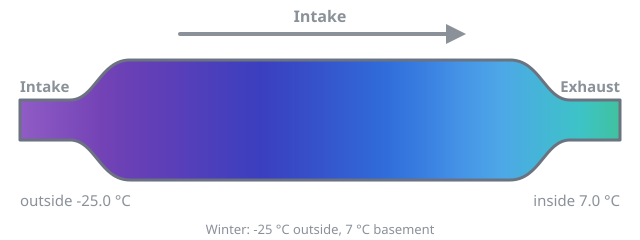
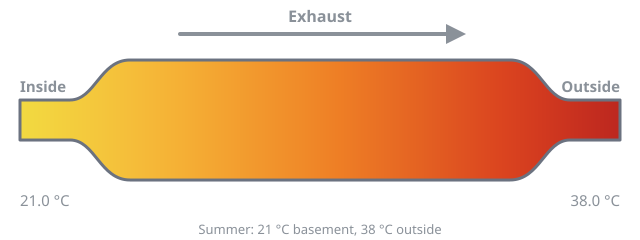

# Recuperator

[](https://github.com/geirskogul/recuperator/releases)
[](https://hacs.xyz/docs/faq/custom_repositories/)
[](https://github.com/geirskogul/recuperator/actions/workflows/tests.yml)
[](https://github.com/geirskogul/recuperator/actions/workflows/validate.yml)
[](LICENSE)

Let a damp basement breathe without throwing its heat away.

This Home Assistant integration runs a **single-tube ceramic recuperator**, a small heat-recovery ventilator, as a breathing cycle. One fan blows room air out through a ceramic core, and the core soaks up its warmth. Then a second fan pulls fresh air in through the same core, and the core hands that warmth back. Out, pause, in, pause, and again.

A temperature probe at each end of the core tells the integration when a breath has done its job. So the rhythm follows the weather on its own: long, efficient breaths when it's cold out, gentler ones in deep frost, and a simple timed rhythm when inside and outside are about the same.

<p align="center"></p>
<p align="center"><sub>A simulated quarter-hour in winter, drawn by the integration's own <a href="#watching-it-breathe">replay</a>.</sub></p>

## What you need

- **Two fans on their own switches.** One blows air out (exhaust), the other blows air in (intake). Any `switch`, `fan`, `light` or `input_boolean` works, for example the two outlets of a smart plug.
- **Two temperature probes in the airflow**, one at each end of the core. The *inside probe* sits at the room end and the *outside probe* at the outdoor end. DS18B20 probes on an ESP32 with ESPHome work well. Have them report every couple of seconds, because a breath only lasts tens of seconds to a few minutes. °C, °F and K are all fine.
- Home Assistant 2025.2 or newer.

## Getting started

[](https://my.home-assistant.io/redirect/hacs_repository/?owner=geirskogul&repository=recuperator&category=integration)
[](https://my.home-assistant.io/redirect/config_flow_start/?domain=recuperator)

1. **Install it through HACS.** Use the first button above, or add `https://github.com/geirskogul/recuperator` as a custom repository of type *Integration*. Download it, then restart Home Assistant.
2. **Add a recuperator.** Use the second button, or go to Settings, Devices & services, Add integration, Recuperator. Give it a name (say *Basement Breather*) and pick the two fans and the two probes.
3. **Check the wiring.** A new recuperator starts with **Breathing** off and leaves your fans alone until you switch it on. Set **Mode** to *Timed* and turn Breathing on:
   - The exhaust fan should run first, then both stop, then the intake fan runs.
   - During exhaust, the outside probe should drift towards the room temperature. During intake, the inside probe should drift towards the outdoor temperature.
   - If either is the wrong way round, swap the fans or the probes with **Reconfigure** in the integration's menu.
4. **Set Mode to Automatic.** It takes a couple of breaths to learn the indoor and outdoor temperatures, and then it finds its own rhythm.

## How it breathes

During exhaust, the inside probe reads the room air going out, and the outside probe shows how far the core's outdoor end has warmed up. During intake it's the other way round. A breath ends at whichever of these comes first:

- **Recovered.** The far end of the core has caught up by the **Recovery target** (80 % of the way, by default).
- **Settled.** The far end has got at least halfway there and has stopped changing, so the core has done what it can.
- **Supply colder than room.** For intakes only: the air coming into the room has dropped more than **Maximum supply drop** (3 °C) below the room temperature. This is the main protection against draughts.
- **Maximum phase.** A plain time limit (2 minutes by default).

No breath ever ends before **Minimum phase** (20 s), which protects the fans and relays. Then both fans rest for the **Pause**, and the other phase begins.

When the probes can't help, the phases simply run for fixed times (**Timed exhaust** and **Timed intake**, 60 s each). That happens in *Timed* mode, when a probe is offline, and when inside and outside are within **Similar temperatures** (2 °C) of each other, so there's nothing to recover.

**Last change reason** always says why the last breath ended. Together with **Last exhaust**, **Last intake** and **Heat recovery**, it's the quickest way to see what the cycle is up to.

### Recovery target

This is the one setting worth thinking about.

- **A low target** (10–25 %) switches as soon as the far end of the core starts to change. The core never runs dry, so incoming air arrives warm. That's the best heat recovery, and it's how commercial units behave: they reverse roughly every minute.
- **A high target** (70–90 %) lets the core fill and empty completely. Each breath moves more air, which helps with a long hose, but the tail end of each breath recovers little heat.

If moving air matters more to you than saving heat, go higher. With a big core or slow fans, even a low target may take minutes to reach. In that case *Maximum phase* sets the rhythm, and that's fine.

### In winter

A cold basement should still breathe, so the room is protected relative to its own temperature rather than by a fixed number. At 7 °C inside and −25 °C outside, an intake keeps going as long as the core warms the incoming air to 4 °C or more.

When it's colder than **Cold threshold** (−5 °C) outside:

- **Intakes are capped** at **Cold intake limit** (5 minutes). Keep this longer than fresh air takes to travel through your ducting. With a long hose, the first part of every intake just pulls back the air you blew out.
- **Exhausts run at least as long as the intake before them**, and up to **Cold exhaust extra** (7 s) longer. The warm air keeps the core's outdoor end from icing up.
- **Frost risk** turns on if an exhaust never warmed the outdoor face of the core above freezing. If you see it, raise *Cold exhaust extra* or shorten the intakes.

The same logic works in summer: the core stores the room's coolness and cools the air coming in.

### What it looked like on the first install

Three ceramic cores in a row, small duct fans at low speed, a hose to the outside, 12 °C outdoors and 20.5 °C in the basement:

- Fresh air took about three minutes to reach the core.
- For those first three minutes, the air entering the basement stayed within 0.3 °C of room temperature. After that it fell by about 0.9 °C a minute.
- So intakes ended after 6–7 minutes, when the air reached the 3 °C supply drop. Exhausts ran about the same, and a full breath took 12–15 minutes.

## On the device page

Everything lives on one device:

- **Breathing**: on or off. Off switches both fans off once, then leaves them alone, so you can run them by hand.
- **Mode**:
  - *Automatic*: the normal probe-driven cycle.
  - *Timed*: fixed lengths, which is handy for testing or with unreliable probes.
  - *Exhaust only* or *Intake only*: runs one fan continuously, for example to dry the room out fast.
- **Phase**, **Last change reason**, **Last exhaust**, **Last intake**, **Heat recovery**, and the learned **Basement temperature** and **Outdoor temperature**.
- **Cold weather** and **Frost risk** indicators.
- A live **Diagram** of the pipe (see below).
- **Every setting** as a number, so you can put them on a dashboard. The less common ones start hidden.

You can also change all the settings at once under **Configure**, **Settings**. Each one has a short explanation there. Changes take effect within a second, without restarting anything.

Breathing, Mode and the learned temperatures all survive a restart. After a restart, it waits up to a minute for the probes, then carries on with an exhaust.

To start over, the **Reset settings to defaults** button resets all the settings and the diagram colours. It never touches your fans, probes, Breathing, Mode or a linked unit.

## Extras

### Phase limit

To keep one phase shorter than the other, set **Phase limit** to *Limited intake* or *Limited exhaust*. The limited phase then never runs longer than **Phase limit share** (90 %) of the other phase just before it. For example, *Limited intake* takes in a bit less air than you blow out. It works in Automatic and Timed mode, and a phase it cuts short ends with the reason *Phase limit*.

A few things still come first:

- **Minimum phase.** A limited phase always runs at least that long.
- **Frost protection.** In cold weather the exhaust keeps running at least as long as the intake, so *Limited exhaust* pauses until it warms up.
- **Passive intakes** are never limited.

### Passive intake

With **Passive intake** on, the intake fan stays off. After each exhaust, the room refills by itself through the core, and the core still warms the air on the way in. This is useful for running on one fan, or for finding out whether your house breathes back on its own.

- A passive intake can last up to **Passive intake maximum** (30 minutes), or less if the usual rules end it sooner.
- **Passive inflow** turns on once the inside probe shows outdoor air really coming in. **Passive inflow delay** says how long that took.
- If Passive inflow never comes on, the air is getting in somewhere else.

### Linked unit

A second unit can breathe in the opposite direction, so the house stays balanced: while this one exhausts, the other takes air in, and the other way round. Set it up under **Configure**, **Linked unit**. It can be a second recuperator with two fans, or just a single intake or exhaust fan. It follows this unit's phases and pauses. A linked full recuperator gets the same interlock as the main one: its two fans never run together.

## Watching it breathe

### The diagram

The **Diagram** image draws the recuperator as a pipe:

- The room end is on the left and the outdoor end on the right.
- The pipe is filled with a colour gradient between the two probe readings, in weather-map colours: purple for bitter cold through blues and greens to orange and red.
- The readings sit in the pipe's ends, and an arrow shows which way the air is moving.




Put it on a dashboard with a picture-entity card:

```yaml
type: picture-entity
entity: image.basement_breather_diagram
show_name: false
show_state: false
```

To use your own colours, go to **Configure**, **Diagram colours**. That page has a colour picker for each temperature stop.

### Replays

A replay turns recorded history into an animation, like the one at the top of this page:

- The pipe breathes as it did at the time.
- Underneath, a history graph of both probes has a cursor sweeping across it in step with the animation.
- It's a plain animated SVG, so it plays in any browser.

The easiest way to make one is the **replay card**, which comes with the integration. There's nothing extra to install. It uses the same date and time picker as Home Assistant's History page: pick a period, press **Create**, and watch.

```yaml
type: custom:recuperator-replay-card
entity: image.basement_breather_replay_animation
```

You'll also find it in the dashboard editor's card list as *Recuperator replay*.

You can also make one from an automation or script, for example a fresh replay of the last day every morning:

```yaml
action: recuperator.create_replay
data:
  hours: 24              # or start: / end: for a specific period (up to 31 days)
  playback_seconds: 60   # length of one loop
```

The replay has its own small **Replay** device, listed under *Connected devices* on the recuperator's page. It holds the latest animation, a **Create** button and the default settings for new replays. Each replay is also saved as `/config/www/recuperator/<name>-replay.svg`, which you can open or share. Keep in mind that Home Assistant serves that folder without a login. Replays can only go back as far as your recorder keeps history, which is 10 days by default.

## Staying safe

- **The two fans never run together.** A fan only starts once the other one reports *off*. If a relay sticks, the cycle waits instead of starting the other fan.
- **A missing probe doesn't stop anything.** The breath just finishes on time.
- **Turning Breathing off, or removing the integration, switches both fans off.**
- **Watch your relays.** A one-minute rhythm means about 2,500 switchings a day per fan, which wears out the relays in ordinary smart plugs. For permanent use, switch the fans with solid-state relays, or lengthen the breaths with *Minimum phase* or *Recovery target*.

## Tuning tips

| If you see... | Try |
| --- | --- |
| Lots of rapid switching | A higher *Minimum phase* or *Recovery target* |
| Cold draughts | A lower *Maximum supply drop*, e.g. 2 °C |
| Intakes ending before fresh air arrives | A higher *Maximum supply drop*, and a *Minimum phase* at least as long as the air takes to arrive |
| Every breath hitting *Maximum phase* | Normal with a big core. Lower the *Recovery target*, or treat *Maximum phase* as your rhythm |
| *Frost risk*, or ice at the outdoor end | A higher *Cold exhaust extra* |
| The room isn't drying out | A lower *Recovery target* (more air changes), or *Exhaust only* for a while |
| Always *Timed* in mild weather | That's expected. Lower *Similar temperatures* if you want the probes to decide anyway |

## When something's off

- **Nothing happens.** Is Breathing on? Does the Phase sensor change? With Breathing off, check that both fans switch from Home Assistant by hand.
- **It's always timed.** The Phase sensor's `timed` attribute says why:
  - `temperatures_similar`: mild weather, or the core isn't connected.
  - `sensor_unavailable`: a probe is offline.
  - `mode`: you're in Timed mode.
- **It's stuck with a fan off.** The other fan's switch probably still reports *on*, and the interlock is waiting for it.
- **More detail.** Turn on debug logging for `custom_components.recuperator`, and every phase change is logged with its reason.
- **Reporting a bug.** Download the diagnostics from the integration's menu and attach them to an [issue](https://github.com/geirskogul/recuperator/issues).

## Recent changes

- **0.5.1.** Fixes a feedback loop: with *Limited intake* on in cold weather, the breaths could shrink one after another down towards *Minimum phase*. The frost rule now keeps each exhaust at least as long as the intake, without also holding it to the shortened intake.
- **0.5.0.** Adds the [Phase limit](#phase-limit).
- **0.4.0.** The readings moved into the pipe's ends. Replays gained the sweeping history graph, and the replay card arrived. Refresh your browser once after updating so the card loads.
- **0.3.0.** Probes reporting in °F are now converted properly. The tuning read-outs moved to the Diagnostic section.

Older notes are in the [releases](https://github.com/geirskogul/recuperator/releases). Your own values are always kept when a new version changes a default.

## Licence

MIT. See [LICENSE](LICENSE).
